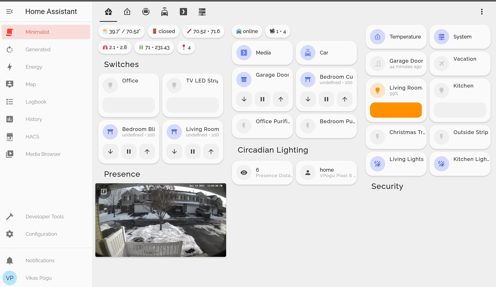

# Home Assistant Configuration


This is my [Home Assistant](https://www.home-assistant.io/) configuration.

## Screenshot

Dashboards are based on [UI-Lovelace-Minimalist Theme](https://ui-lovelace-minimalist.github.io/UI/)



## Manual Installation

- Go to [release page](https://github.com/UI-Lovelace-Minimalist/UI/releases) and download the `ui_lovelace_minimalist.zip` attached to the latest release
- Create a new folder `minimalist-templates` under `/config` 
- Unpack the file and move the folder it contains called `ui_lovelace_minimalist/lovelace` to the `minimalist-templates`

### Custom updates to UI lovelace

- Create `red_open`, `red_close`, `green_open` and `green_close` button templates under colors\
- Custom card irmajavi_entities, update label

```yaml
custom_widget_irmajavi:
  show_label: true
  show_icon: false
  label: |
    [[[
        var unit = entity.attributes.unit_of_measurement != null ? ' ' + entity.attributes.unit_of_measurement: ''
        if (entity.state == 'on') {
          return 'On';
        } else if (entity.state == 'off') {
          return 'Off';
        } else if (entity.state == 'unavailable') {
          return variables.ulm_unavailable;
        } else if (entity.state == 'idle') {
          return variables.ulm_idle;
        } else if (entity.state == 'open') {
          return variables.ulm_open;
        } else if (entity.state == 'closed') {
          return variables.ulm_closed;
        } else {
          return entity.state + unit;
        }
    ]]]
```

### Custom cards list

- irmajavi_speedtest
- schumijo_car
- apexcharts
- car_gauge
- httpedo13_sun
- irmajavi_entities
- mpse_printer
- nik_nas
- vncntdev_card_device_tracer

## Integrations

- [Speedtest.net](https://www.speedtest.net/)
- [MQTT](https://www.home-assistant.io/integrations/mqtt/)
- [ble monitor](https://github.com/custom-components/ble_monitor/)
- [browser-mod](https://github.com/thomasloven/hass-browser_mod)
- [Eufy vacuum](https://github.com/pbulteel/eufy_vacuum)
- [Frigate](https://github.com/blakeblackshear/frigate-hass-integration)
- [Lovelace Gen](https://github.com/thomasloven/hass-lovelace_gen)
- Circadian Lighting
- Bravia TV PSK
- Node-Red Companion
- Nest
- Synology DSM
- TP-Link Kasa
- Sony Bravia TV
- Soma
- Smartthings
- iRobot vaccum
- IPP Printer
- Govee
- HACS
- Font awesome

## Lovelace Plugins

- [auto-entities](https://github.com/thomasloven/lovelace-auto-entities)
- [bar-card](https://github.com/custom-cards/bar-card)
- [button-card](https://github.com/custom-cards/button-card)
- [card-mod](https://github.com/thomasloven/lovelace-card-mod)
- [card-tools](https://github.com/thomasloven/lovelace-card-tools)
- [hui-element](https://github.com/thomasloven/lovelace-hui-element)
- [light-entity-card](https://github.com/ljmerza/light-entity-card)
- [light-popup-card](https://github.com/DBuit/light-popup-card)
- [lovelace-layout-card](https://github.com/thomasloven/lovelace-layout-card)
- [multiple-entity-row](https://github.com/benct/lovelace-multiple-entity-row)
- [mini-graph-card-bundle](https://github.com/kalkih/mini-graph-card)
- [scheduler-card](https://github.com/nielsfaber/scheduler-card)
- [simple-thermostat](https://github.com/nervetattoo/simple-thermostat)
- [vacuum-card](https://github.com/denysdovhan/vacuum-card)
- [vertical-stack-in-card](https://github.com/ofekashery/vertical-stack-in-card)
- [weather-card](https://github.com/bramkragten/weather-card)
- apexcharts-card
- home-assistant-sun-card
- simple-weather-card-bundle

### Google Fonts

- **Headlines:** Comfortaa [Google Fonts](https://fonts.google.com/specimen/Comfortaa)
- **Content:** Raleway [Google Fonts](https://fonts.google.com/specimen/Raleway)

### HA

#### Conbee II USB for the RPi 4

1. Plugged it into the USB.
2. Popped out the SD card and used [USB reader *](https://amzn.to/3pOwVI1) to access on another computer.
3. Edited config.txt
   Config Device Pi3B, Pi3B+ or Pi4:
   **Raspberry Pi 3B** or older:

    ```yaml
    enable_uart=1
    dtoverlay=pi3-disable-bt
    ```

4. **Raspberry Pi 3B+ or 4**

    ```yaml
    enable_uart=1
    dtoverlay=pi3-miniuart-bt
    ```

5. Put SD card back in RPi and turned it on.
6. Went to Configuration > deCONZ.

    ```yaml
    device: >-
      /dev/serial/by-id/usb-dresden_elektronik_ingenieurtechnik_GmbH_ConBee_II_DE2408889-if00
    ```

### Add to existing folder

```bash
# Clone just the repository's .git folder (excluding files as they are already in
# `existing-dir`) into an empty temporary directory
git clone --no-checkout https://github.com/Vikaspogu/homeassistant.git home-assistant.tmp # might want --no-hardlinks for cloning local repo

# Move the .git folder to the directory with the files.
# This makes `existing-dir` a git repo.
mv home-assistant.tmp/.git .

# Delete the temporary directory
rmdir home-assistant.tmp/

# git thinks all files are deleted, this reverts the state of the repo to HEAD.
# WARNING: any local changes to the files will be lost.
git reset --hard HEAD
```

### Get plex token

https://digiex.net/threads/plex-guide-step-by-step-getting-plex-token.15402/