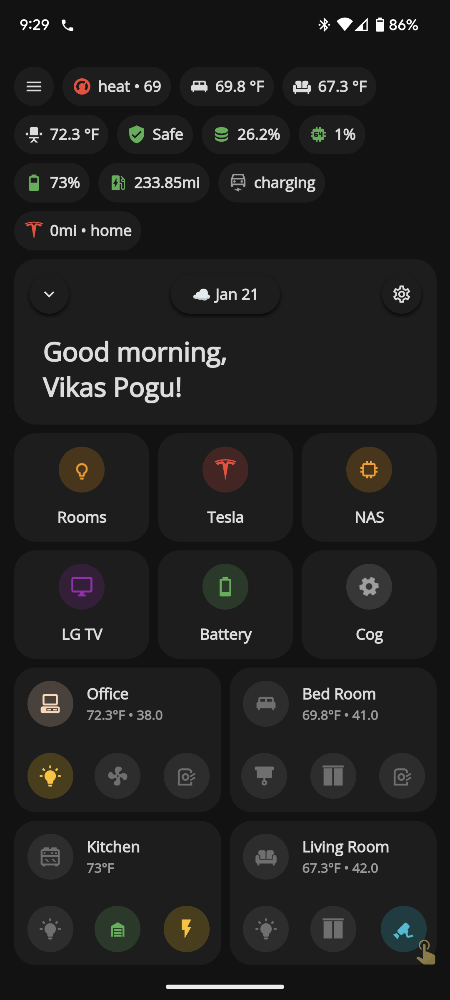

# Home Assistant Configuration


This is my [Home Assistant](https://www.home-assistant.io/) configuration.

## Screenshot

Dashboards are based on [Mushroom Cards](https://github.com/piitaya/lovelace-mushroom) and [UI-Lovelace-Minimalist Theme](https://ui-lovelace-minimalist.github.io/UI/)



### Custom Cards from UI Minimalist

- irmajavi_speedtest
- apexcharts
- httpedo13_sun
- mpse_printer
- nik_nas

## Integrations

- [Speedtest.net](https://www.speedtest.net/)
- [MQTT](https://www.home-assistant.io/integrations/mqtt/)
- [browser-mod](https://github.com/thomasloven/hass-browser_mod)
- [Eufy vacuum](https://github.com/pbulteel/eufy_vacuum)
- [Frigate](https://github.com/blakeblackshear/frigate-hass-integration)
- [Lovelace Gen](https://github.com/thomasloven/hass-lovelace_gen)
- Circadian Lighting
- Bravia TV PSK
- Node-Red Companion
- Nest
- Synology DSM
- TP-Link Kasa
- Sony Bravia TV
- Soma
- Smartthings
- IPP Printer
- Govee
- HACS
- Font awesome

## Lovelace Plugins

- [auto-entities](https://github.com/thomasloven/lovelace-auto-entities)
- [bar-card](https://github.com/custom-cards/bar-card)
- [button-card](https://github.com/custom-cards/button-card)
- [card-mod](https://github.com/thomasloven/lovelace-card-mod)
- [card-tools](https://github.com/thomasloven/lovelace-card-tools)
- [light-entity-card](https://github.com/ljmerza/light-entity-card)
- [light-popup-card](https://github.com/DBuit/light-popup-card)
- [lovelace-layout-card](https://github.com/thomasloven/lovelace-layout-card)
- [multiple-entity-row](https://github.com/benct/lovelace-multiple-entity-row)
- [mini-graph-card-bundle](https://github.com/kalkih/mini-graph-card)
- [vertical-stack-in-card](https://github.com/ofekashery/vertical-stack-in-card)
- apexcharts-card
- home-assistant-sun-card

### Google Fonts

- **Headlines:** Comfortaa [Google Fonts](https://fonts.google.com/specimen/Comfortaa)
- **Content:** Raleway [Google Fonts](https://fonts.google.com/specimen/Raleway)

### HA

### Add to existing folder

```bash
# Clone just the repository's .git folder (excluding files as they are already in
# `existing-dir`) into an empty temporary directory
git clone --no-checkout https://github.com/Vikaspogu/homeassistant.git home-assistant.tmp # might want --no-hardlinks for cloning local repo

# Move the .git folder to the directory with the files.
# This makes `existing-dir` a git repo.
mv home-assistant.tmp/.git .

# Delete the temporary directory
rmdir home-assistant.tmp/

# git thinks all files are deleted, this reverts the state of the repo to HEAD.
# WARNING: any local changes to the files will be lost.
git reset --hard HEAD
```

### Get plex token

https://digiex.net/threads/plex-guide-step-by-step-getting-plex-token.15402/