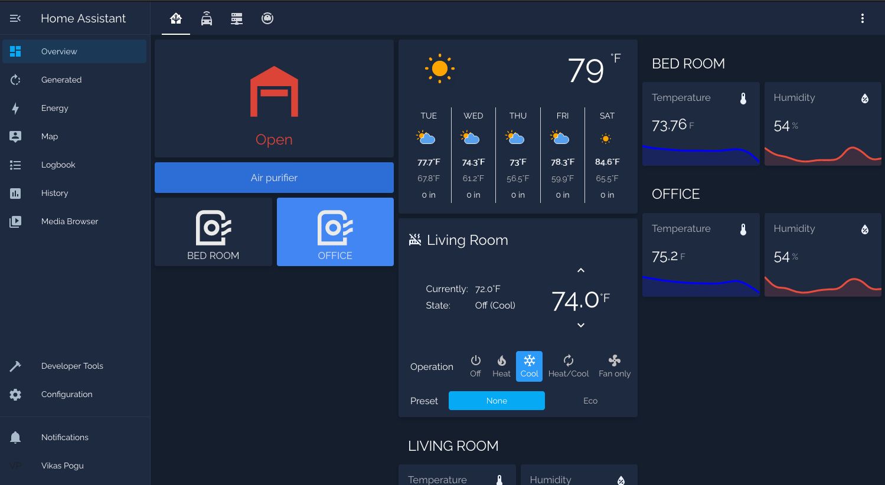

# Home Assistant Configuration


This is my [Home Assistant](https://www.home-assistant.io/) configuration.

## Screenshot



## Hass.io Addons


- Roomba
- Internet Printing Protocol
- Nest
- TP Link Smart Home
- Transmission
- [Speedtest.net](https://www.speedtest.net/)
- [MQTT](https://www.home-assistant.io/integrations/mqtt/)

## Custom Components

- [ble monitor](https://github.com/custom-components/ble_monitor/)
- [browser-mod](https://github.com/thomasloven/hass-browser_mod)
- [Eufy vacuum](https://github.com/pbulteel/eufy_vacuum)
- [Frigate](https://github.com/blakeblackshear/frigate-hass-integration)
- [Lovelace Gen](https://github.com/thomasloven/hass-lovelace_gen)
- [Plex recently added](https://github.com/custom-components/sensor.plex_recently_added)
- [Scheduler](https://github.com/nielsfaber/scheduler-component.git)
- [Sonarr upcoming media](https://github.com/custom-components/sensor.sonarr_upcoming_media)

## Lovelace Plugins

- [auto-entities](https://github.com/thomasloven/lovelace-auto-entities)
- [bar-card](https://github.com/custom-cards/bar-card)
- [button-card](https://github.com/custom-cards/button-card)
- [card-mod](https://github.com/thomasloven/lovelace-card-mod)
- [card-tools](https://github.com/thomasloven/lovelace-card-tools)
- [hui-element](https://github.com/thomasloven/lovelace-hui-element)
- [light-entity-card](https://github.com/ljmerza/light-entity-card)
- [light-popup-card](https://github.com/DBuit/light-popup-card)
- [lovelace-layout-card](https://github.com/thomasloven/lovelace-layout-card)
- [multiple-entity-row](https://github.com/benct/lovelace-multiple-entity-row)
- [mini-graph-card-bundle](https://github.com/kalkih/mini-graph-card)
- [scheduler-card](https://github.com/nielsfaber/scheduler-card)
- [simple-thermostat](https://github.com/nervetattoo/simple-thermostat)
- [transmission-card](https://github.com/amaximus/transmission-card)
- [upcoming-media-card](https://github.com/custom-cards/upcoming-media-card/)
- [vacuum-card](https://github.com/denysdovhan/vacuum-card)
- [vertical-stack-in-card](https://github.com/ofekashery/vertical-stack-in-card)
- [weather-card](https://github.com/bramkragten/weather-card)

### Google Fonts

- **Headlines:** Comfortaa [Google Fonts](https://fonts.google.com/specimen/Comfortaa)
- **Content:** Raleway [Google Fonts](https://fonts.google.com/specimen/Raleway)

### HA

#### Conbee II USB for the RPi 4

1. Plugged it into the USB.
2. Popped out the SD card and used [USB reader *](https://amzn.to/3pOwVI1) to access on another computer.
3. Edited config.txt
   Config Device Pi3B, Pi3B+ or Pi4:
   **Raspberry Pi 3B** or older:

    ```yaml
    enable_uart=1
    dtoverlay=pi3-disable-bt
    ```

4. **Raspberry Pi 3B+ or 4**

    ```yaml
    enable_uart=1
    dtoverlay=pi3-miniuart-bt
    ```

5. Put SD card back in RPi and turned it on.
6. Went to Configuration > deCONZ.

    ```yaml
    device: >-
      /dev/serial/by-id/usb-dresden_elektronik_ingenieurtechnik_GmbH_ConBee_II_DE2408889-if00
    ```

### DEBUGGING and Errors

- [x] **ERROR** ~~vacuum-card/vacuum-card.js Error: Cannot read property 'states' of undefined~~ [~~GitHub #169~~](https://github.com/denysdovhan/vacuum-card/issues/169)
- [ ] **ERROR** synology_dsm dont work. Go in long loading point.

### Robovac Eufy

Use the Blue Stacks android emulator and the Eufy Home app version 2.3.2 (you can find this older version on sites like APKmirror). Check out this link for reference.

You'll need adb on the Mac (install Android Platform Tools) along with Bluestacks

1- launch Bluestacks and enable USB Debugging / ADB (Bluestacks -> Preferences -> Preferences -> 'Enable Android Debug Bridge (ADB)

2 - Install the older Eufy Home App (2.3.2 works great) in Bluestacks

3 - In terminal on your Mac - adb connect 127.0.0.1

4 - In terminal on your Mac - adb shell (If you get a duplicate connection error do adb kill-server then adb shell or adb server-start followed by adb shell)

5 - You should see you are now in the emulated device's shell, now type logcat -e 'tuya.m.my.group.device.list' to start logcat listening

6 - Start the EufyHome app in Blue Stacks and log in. You'll see data now in your terminal window. Command-F to search the logcat output for "devid" and "localkey", you'll need both to add the device to the Homebridge plugin.

### Add to existing folder

```bash
# Clone just the repository's .git folder (excluding files as they are already in
# `existing-dir`) into an empty temporary directory
git clone --no-checkout https://github.com/Vikaspogu/homeassistant.git home-assistant.tmp # might want --no-hardlinks for cloning local repo

# Move the .git folder to the directory with the files.
# This makes `existing-dir` a git repo.
mv home-assistant.tmp/.git .

# Delete the temporary directory
rmdir home-assistant.tmp/

# git thinks all files are deleted, this reverts the state of the repo to HEAD.
# WARNING: any local changes to the files will be lost.
git reset --hard HEAD
```

### Get plex token

https://digiex.net/threads/plex-guide-step-by-step-getting-plex-token.15402/